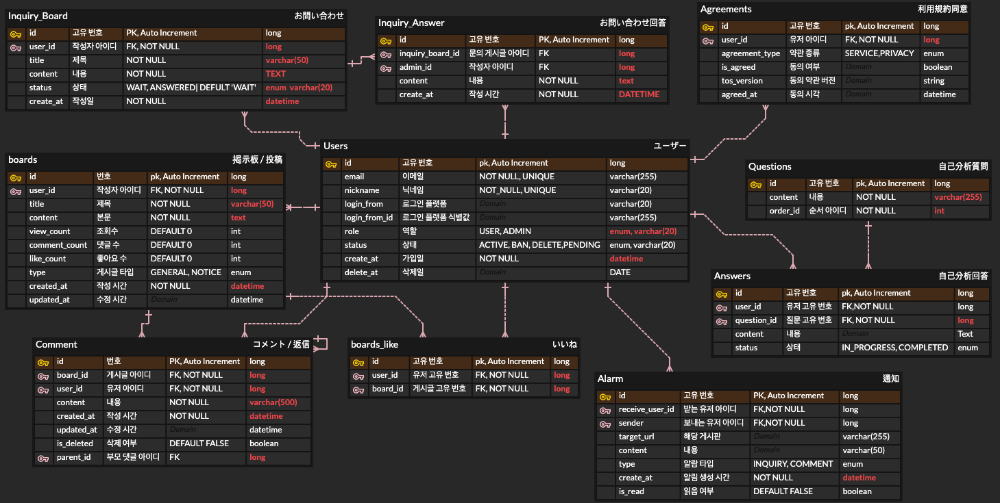

# 🔍 MIRU
> 일본 취업을 목표로 하는 한국인 학생을 위한 자기분석 지원 웹 앱

🔗 [miru.io.kr](https://miru.io.kr)

> 🇰🇷 한국어 | [🇯🇵 日本語](./README.md)

---

## 📋 목차

1. [서비스 개요](#-서비스-개요)
2. [프로젝트 멤버](#-프로젝트-멤버)
3. [주요 기능](#-주요-기능)
4. [기술 스택](#-기술-스택)
5. [ERD](#-erd)
6. [담당 파트](#-담당-파트)
7. [시스템 구성도](#-시스템-구성도)

---

## 📌 서비스 개요

본 서비스는 일본 취업을 목표로 하는 한국인 학생들이 자기분석의 중요성을 이해하고, 질문 기반으로 사고를 심화하면서 자신의 경험·가치관·지원 동기를 자신의 언어로 표현할 수 있는 상태를 만들어주는 자기분석 지원 서비스입니다.

단순히 모범 답안을 보여주거나 깔끔한 문장을 자동 생성하는 것이 목적이 아닙니다. 면접에서 깊이 파고들어 오는 질문에도 흔들리지 않도록, 자신의 경험을 스스로의 머리로 정리하고 자신의 언어로 이야기할 수 있는 상태를 만드는 것을 목표로 합니다.

### 🎌 이 서비스를 만든 배경

같은 학과 친구들이 일본 취업을 준비하는 과정에서, 자기분석 단계에서 공통적으로 큰 벽에 부딪히는 모습을 가까이서 지켜봐 왔습니다.

일본 취업에 필요한 자기분석 방법과 정보를 찾는 과정은 한국인 학생에게 있어 매우 손에 잡히지 않고 돌아가기 쉬운 길이 됩니다. 그런 친구들의 불필요한 시행착오를 조금이라도 줄이고 싶다는 마음에서 이 서비스가 탄생했습니다.

자기분석은 단순한 문장 작성이 아니라, 취업의 성패를 가르는 핵심 프로세스입니다. 그 과정을 보다 효율적으로, 그리고 "자신의 언어"로 진행할 수 있도록 본 서비스를 개발했습니다.

---

## 👥 프로젝트 멤버

| <a href="https://github.com/Chanwoo1124"> 이찬우</a> | <a href="https://github.com/wyLortel"> 정우연</a> | <a href="https://github.com/Seo-JeongJin"> 서정진</a> |
|:---:|:---:|:---:|
| 팀 리더 · 백엔드 | 프론트엔드 | 프론트엔드 |

---

## ⚡ 주요 기능

| 기능 | 설명 |
|------|------|
| 소셜 로그인 | Google (OAuth 2.0)을 통한 간편하고 안전한 로그인 |
| 자기분석 작성/편집 | 에디터를 활용한 강점 및 경험의 체계적인 정리 |
| 커뮤니티 게시판 | 게시글, 좋아요, 댓글/답글을 통한 사용자 간 교류 |
| 실시간 알림 | 뱃지 및 알림 목록을 통한 중요 정보 즉시 확인 |
| 1:1 문의 | 관리자에게 직접 문의 및 답변 확인 |
| 마이페이지 | 프로필, 활동 내역 관리 및 회원 탈퇴 기능 |
| 관리자 기능 | 사용자 관리 및 문의 대응 |

---

## 🛠 기술 스택

| 카테고리 | 기술 |
|------|------|
| 프론트엔드 | Next.js 16, TanStack Query 5, Tailwind CSS 4, Zustand, Axios |
| 백엔드 | Java, Spring Boot, Spring Data JPA, OAuth2 |
| 데이터베이스 | MySQL |
| 인프라 | AWS (EC2, RDS) |
| CI/CD | GitHub Actions |

---

## 🗂 ERD

---

## 👨‍💻 담당 파트 — 이찬우 (팀 리더 · 백엔드)

| 카테고리 | 내용 |
|------|------|
| DB 설계 | 테이블 설계 · ERD 작성 |
| API 설계 | 전체 API 설계 · 사양 책정 |
| 자기분석 API | 질문 · 답변 작성, 진척 관리 |
| 게시판 API | 게시글 작성 · 수정 · 삭제 · 목록 조회 |
| 댓글 API | 댓글 · 답글 작성 · 삭제 |
| 알림 API | 실시간 알림 송수신 처리 |
| 1:1 문의 API | 문의 작성 · 관리자 답변 처리 |
| 관리자 API | 사용자 관리 · 문의 대응 |
| 인프라 구축 | AWS EC2 · RDS 환경 구축 · 설정 |
| CI/CD | GitHub Actions를 이용한 EC2 자동 배포 구축 |

---

## 🏗 시스템 구성도

